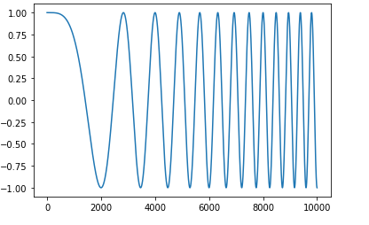
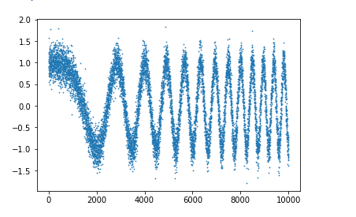
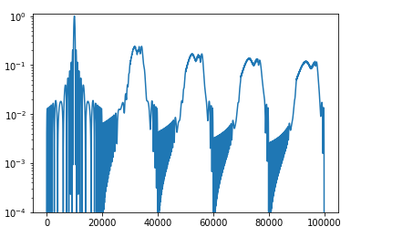
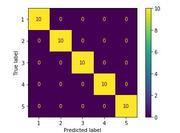

# Machine Learning for Chirp Detection
A program to generate sample polynomial phase chirps and identify noisy chirps using Machine Learning. 
The model used was a Support Vector Machine (SVM) which was trained on 1500 generated chirps. 

## Images 
  
<strong> An Example Chirp generated </strong>  

  
<strong>A Noisy Chirp generated </strong>  

  
<strong> Using Matched Filtering to identify which chirp is the noisy one based off </strong>  
  
<strong> Testing a SVM model using a confusion matrix </strong> 

## Dependencies
* Jupyter Notebook
* Python 3.7 or above
* SciKit-Learn
* Pandas
* Numpy 
* Matplotlib 
* Pickle
* Cmath  
<strong> All libraries are included with the most recent version of Anaconda </strong> 

## Authors
David Luong, Carleton Univeristy   
Dr. Sreeraman Rajan, Carleton University   
Omar Imran, Carleton University  

This project was funded by the I-CUREUS grant provided by the Carleton University Discovery Center.
